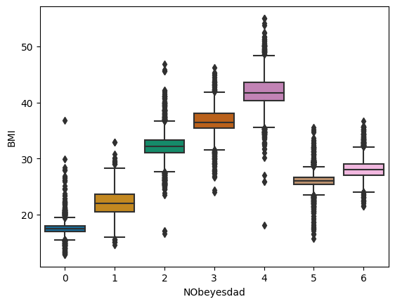

# PS4E02

[Kaggle PS4E02 - Multi-Class Prediction of Obesity Risk](https://www.kaggle.com/competitions/playground-series-s4e2)

- Team name: **I'm unemployed, please hire me** (Ranked 484/3587 - top 14%)
- Public test: 0.91112
- Private test: 0.90823

## Summarize

### Data insight

By a common sense, obesity risk of a person is reflected by his **BMI**. However, this contest use a **generated** dataset, which f#cked up the common sense really, really bad. For example, by inspecting BMIs we can easily point out some outliers of obesity risk labeled 5 has the same BMI with label 1.

This leads to the fact that, all submissions in public test cannot pass the threshold of 0.93.

Therefore, combining original data with generated data seems to be a good approach.

### Feature engineering

- [Replace `Frequently` with `Always`](https://www.kaggle.com/competitions/playground-series-s4e2/discussion/472597#2631021): by a common sense, these are equivalent (and no `Frequently` could be found in the test set).
- Adding BMI, BMI_prime (BMI/25)

### Modeling

Still, this contest highlighted the importance of stacking & voting.

### Finding best classifiers

- [lazy-classifier](https://github.com/shankarpandala/lazypredict) shows that best classifiers to this problem are Extra Tree, Random Forest, Decision Tree, Bagging Classiifer, SVC, Logistic Regression, XGB and LGBM.
- Using [optuna](https://github.com/optuna/optuna) to find best parameters.

Stacking these results and we achieved our highest score, reported above. Also, this contest highlighted a new approach using AutoML - [AutoGluon](https://github.com/autogluon). We achieved a near-highest score with AutoGluon (0.90787 and 0.90751 for public and private test, respectively).

## Evaluation

Submissions are evaluated using the [accuracy score](https://en.wikipedia.org/wiki/Accuracy_and_precision).

## LICENSE

This project is licensed under [The GNU GPL v3.0](LICENSE)
